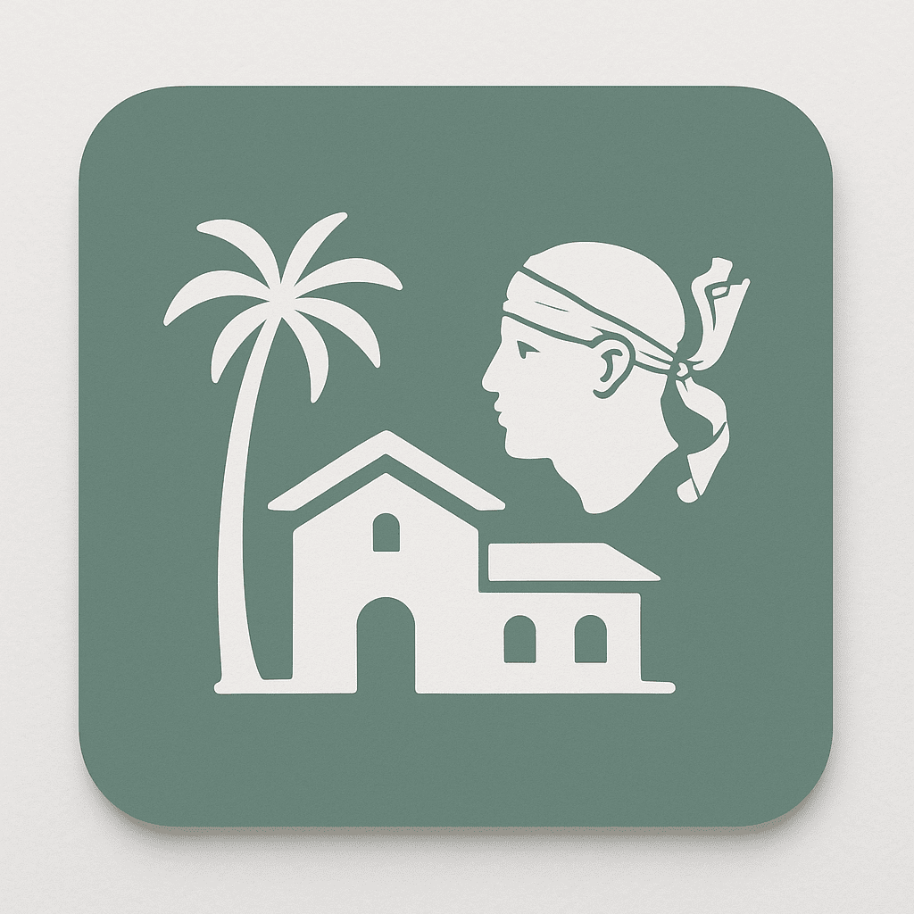

<div align="center">
  

  <h3 align="center">Villa Morticcione</h3>

  <p align="center">
    Source code for the Villa Morticcione showcase website.
  </p>
</div>

## ℹ️ About the project

This project explores building a luxury villa rental website using Next.js 15 with the App Router, emphasizing server-side rendering (SSR) and SEO optimization. The aim is to deliver a fast, responsive, and visually refined site that performs well in search engine rankings.

The second goal of this project is to explore how far AI can assist in building such a website, especially with tasks that I don't enjoy (design, writing, SEO, etc.).

## 🧠 Tasks done by AI (Claude Sonnet 4)

- **Design**: Created the initial design system and UI components using shadcn/ui ✅
- **Project Structure**: Suggested the overall Next.js project structure ✅
- **SEO Optimization**: Provided guidelines for SEO best practices ✅
- **Client-side email sending solutions**: Recommended EmailJS for sending emails from the client side + integration tips ✅

## 🏗️ Tech Stack

- **Framework**: Next.js 15 with App Router
- **Language**: TypeScript
- **Styling**: Tailwind CSS v4
- **UI Components**: [shadcn/ui](https://ui.shadcn.com/)
- **Package Manager**: Bun
- **Deployment**: Static for GitHub Pages using [nextjs-github-pages](https://github.com/gregrickaby/nextjs-github-pages)

## 📁 Project Structure

```
src/
├── app/                    # Next.js App Router pages
│   ├── villa/              # Villa showcase pages
│   │   ├── _components/    # Reusable components for villa pages
│   │   └── page.tsx        # Villa showcase homepage
│   ├── layout.tsx          # Root layout with SEO metadata
│   ├── page.tsx            # Homepage
│   └── globals.css         # Global styles
├── components/             # Reusable React components
│   ├── ui/                 # shadcn/ui components
│   └── Header.tsx          # Navigation header
└── lib/                    # Utility functions
    └── utils.ts            # Common utilities
```

## 🛠️ Getting Started

First, install dependencies:

```bash
bun install
```

Then, run the development server:

```bash
bun run dev
```

Open [http://localhost:3100](http://localhost:3100) with your browser to see the result.

## 📄 License

All rights reserved - Villa Morticcione
